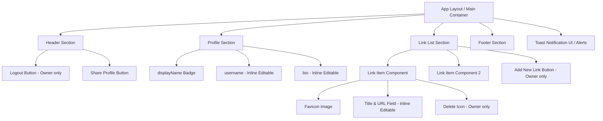

# 마이링크 와이어프레임 (Wireframes)

## 1. 방문자 뷰 (Visitor View)

방문자가 `mylink.com/닉네임` 에 접속했을 때 보이는 깔끔한 화면입니다.

```text
+--------------------------------------------------+
|                                                  |
|                                   [공유 아이콘]  |
|                                                  |
|            +------------------------+            |
|            |                        |            |
|            |      @displayName      |            |
|            |     (URL 슬러그용)     |            |
|            +------------------------+            |
|                                                  |
|                 우지헌 (username)                |
|                                                  |
|        "안녕하세요! 프론트엔드 개발자입니다."    |
|                                                  |
|  +--------------------------------------------+  |
|  |  [F]  GitHub 포트폴리오                    |  |
|  +--------------------------------------------+  |
|                                                  |
|  +--------------------------------------------+  |
|  |  [F]  LinkedIn 프로필                      |  |
|  +--------------------------------------------+  |
|                                                  |
|  +--------------------------------------------+  |
|  |  [F]  개인 블로그                          |  |
|  +--------------------------------------------+  |
|                                                  |
|                                                  |
|              powered by My Link                  |
+--------------------------------------------------+
```
*`[F]`는 구글 파비콘 API를 통해 추출된 타겟 URL의 아이콘(Favicon)을 의미합니다.*

---

## 2. 소유자 뷰 (Owner View - 관리자 화면)

소유자가 로그인했을 때 제공되는 화면입니다. 
본명(`username`)이나 자기소개 텍스트를 클릭하여 바로 수정할 수 있으며, 링크 항목 우측에 `[삭제]` 버튼이 활성화됩니다.

```text
+--------------------------------------------------+
| [로그아웃]                        [공유 아이콘]  |
|                                                  |
|            +------------------------+            |
|            |      @displayName      |            |
|            |     (URL 슬러그용)     |            |
|            +------------------------+            |
|                                                  |
|       [✏️ 우지헌 (클릭하여 닉네임 편집) ]        |
|                                                  |
|   [✏️ 안녕하세요! 프론트엔드 개발자... (편집)]   |
|                                                  |
|  +--------------------------------------------+  |
|  | [F] [✏️ GitHub 포트폴리오 URL/제목 ]   [🗑️]|  |
|  +--------------------------------------------+  |
|                                                  |
|  +--------------------------------------------+  |
|  | [F] [✏️ LinkedIn 프로필 URL/제목 ]     [🗑️]|  |
|  +--------------------------------------------+  |
|                                                  |
|  +--------------------------------------------+  |
|  |         [ + 새 링크 추가하기 ]             |  |
|  +--------------------------------------------+  |
|                                                  |
|   (토스트 알림: "성공적으로 저장되었습니다.")    |
+--------------------------------------------------+
```

---

## 3. 화면 구조 및 컴포넌트 다이어그램 (Mermaid)

화면을 구성하는 컴포넌트(Component) 간의 계층 구조와 포함 관계를 나타냅니다.



## 4. UI/UX 설계 의도 (개선점 반영)
- **인라인 편집 (Inline Editing)**: 사용자가 복잡한 '설정' 페이지로 이동하지 않고, 화면 내에서 텍스트(이름, 소개, 링크 제목 등)를 클릭하면 즉시 입력 폼으로 전환되어 매우 빠른 수정이 가능합니다.
- **직관적인 추가 버튼**: `+ 새 링크 추가하기` 버튼을 리스트 바로 하단에 배치하여 플로우(흐름)를 깨지 않고 직관적으로 링크를 덧붙일 수 있도록 유도했습니다.
- **시각적 피드백 (Toast UI)**: 링크가 삭제되거나 수정되었을 때 화면 하단에 알림 메시지(Toast)를 띄워 주어, 사용자가 자신의 동작이 정상 처리되었음을 확신할 수 있도록 했습니다.
